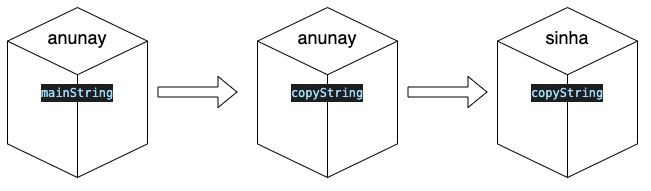
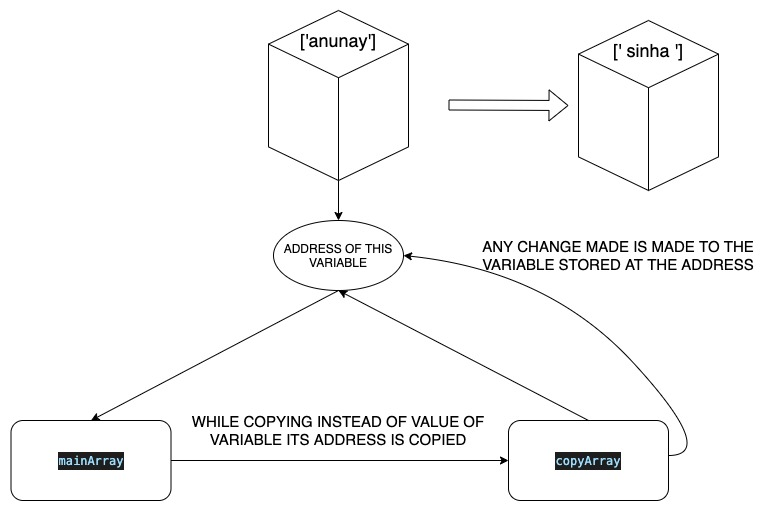

## Why there is a difference in behavior for copying contents in primitive and non primitive type?  
   - The difference in behavior between primitive and non-primitive data types comes from the fact that what is being copied. 
   
   
    
```JavaScript
    check1 = function(){
        let mainString = 'anunay';
        let copyString = mainString;
        copyString = 'sinha';
        console.log(mainString,copyString);
    }
    check1();
    
    // Output -> anunay sinha
```



```JavaScript
    check2 = function(){
        let mainArray = ['anunay'];
        let copyArray = mainArray;
        copyArray[0] = 'sinha';
        console.log(mainArray,copyArray);
        }
        check2();
        
        //Output -> [ 'sinha' ] [ 'sinha' ]
```


## What is the difference between window, screen, and document in Javascript?


### COMMANDS USED WERE - (THESE WERE DONE ON MAC TERMINAL)
1. clear -> *Clears the terminal*  
2. ls -> *Lists all available files in that directory*
3. ls *.js -> *Lists all files with 'js' as suffix in the directory*  
4. cd guvi -> *Opens the directory guvi in the present directory*
5. mkdir guvi -> *Creates a directory 'guvi' in the present directory*
6. cd .. -> *Moves one directory above the present directory*
7. cd \ -> *Moves to the root directory*
8. nano guvi.js -> *Opens guvi.js file using nano text-editor. If the file does not exist, creates it*
9. mv guvi.txt guvi2.txt -> *Renames guvi.txt to guvi2.txt*
10. rm guvi2.txt -> *Deletes guvi2.txt*
11. cp guvi.txt guvi/guvi.txt -> *Copies the file guvi.txt into a sub-directory 'guvi'*
12. rm -R guvi -> *Deletes the subdirectory guvi*
13. sudo rm guvi.txt *Runs this command with superuser privileges*
14. rmdir guvi -> *Deletes the empty directory guvi*
15. node guvi.js -> *Runs the JS code in the terminal. This can be run only after installing node*
