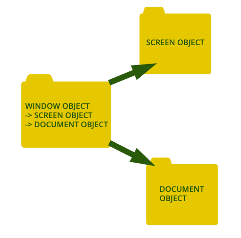

## Why there is a difference in behavior for copying contents in primitive and non primitive type?  
   - The difference in behavior between primitive and non-primitive data types comes from the fact that what is being copied. 
  
    
```JavaScript
    check1 = function(){
        let mainString = 'anunay';
        let copyString = mainString;
        copyString = 'sinha';
        console.log(mainString,copyString);
    }
    check1();
    
    // Output -> anunay sinha
```
   
   
   Since value is directly being copied any change in the second variable does not impact the first variable, which in the next case is not true.

```JavaScript
    check2 = function(){
        let mainArray = ['anunay'];
        let copyArray = mainArray;
        copyArray[0] = 'sinha';
        console.log(mainArray,copyArray);
        }
        check2();
        
        //Output -> [ 'sinha' ] [ 'sinha' ]
```


## What is the difference between window, screen, and document in Javascript?

- Window is the global object in JavaScript (JS) availble through browser. It sits on the top. Think of it as an all encapsulating box consisting of other objects and methods that can be manipulated using JS.
  - Methods include `alert` and `prompt`. Use `console.dir(window)` for complete list of methods and properties of window.

- Document object accessible through `window.document` gives access to DOM of website. It is this object that is dynamically edited through the backend scripting to customize webpages. Methods like `document.getElementById('string')` gives direct access to the content

- Screen object accessible through `window.screen` gives information about the screen such as width - `screen.width` - and height - `screen.width`. This is important for correct preparation of layout and subsequent painting




### COMMANDS USED WERE - (THESE WERE DONE ON MAC TERMINAL)
1. clear -> *Clears the terminal*  
2. ls -> *Lists all available files in that directory*
3. ls *.js -> *Lists all files with 'js' as suffix in the directory*  
4. cd guvi -> *Opens the directory guvi in the present directory*
5. mkdir guvi -> *Creates a directory 'guvi' in the present directory*
6. cd .. -> *Moves one directory above the present directory*
7. cd \ -> *Moves to the root directory*
8. nano guvi.js -> *Opens guvi.js file using nano text-editor. If the file does not exist, creates it*
9. mv guvi.txt guvi2.txt -> *Renames guvi.txt to guvi2.txt*
10. rm guvi2.txt -> *Deletes guvi2.txt*
11. cp guvi.txt guvi/guvi.txt -> *Copies the file guvi.txt into a sub-directory 'guvi'*
12. rm -R guvi -> *Deletes the subdirectory guvi*
13. sudo rm guvi.txt *Runs this command with superuser privileges*
14. rmdir guvi -> *Deletes the empty directory guvi*
15. node guvi.js -> *Runs the JS code in the terminal. This can be run only after installing node*


## A DIVE INTO OBJECTS OF JAVASCRIPT

Before we move ahead we need to answer what is an *Object*. Lets draw an analogy between Objects and a Car.

Just like car has many properties - engine, wheels, chasis among others an object can also have many aka properties. This can further go on in a hierarchial way. Just like engine of car has properties of its own - torque, fuel-efficiency, similarly there can be other objects inside an object, which in turn have their own defining features.

let us say we have a 'Red Coloured Audi A7'. We would want to know about the engine of the car, similar queries will need to be done about an object of JS too. 

```JavaScript
    let car ={
        name: 'AudiA7',
        engine: '3000cc',
        color: 'Red',
        wheel: '190'};

    // TO ACCESS THE 'PROPERTIES' WE MAKE FOLLOWING QUERIES

    console.log(car.name)
    console.log(car.wheel)
```
Now, the point of the car is to move around and reach from one place to another, that is, there are functional aspects of having a car. Same goes with JS Objects, the functions in this case are called `methods`.

```JavaScript
    let car ={
        name: 'AudiA7',
        engine: '3000cc',
        color: 'Red',
        wheel: '190',
        wheelSize: function(){
            return `The size of the wheel is ${this.wheel} mm`
            }
    }

    // TO ACCESS THE METHOD WE DO THE FOLLOWING

    console.log(car.wheelSize())
```
We can have modifications to our car. Sometimes we add 'Spoilers' other times we install new music system. We would like to do same to our objects as well. Here is how we can do it.

```JavaScript

    car.spoilerPresent = true

```

Just like we added features to the car we would sometimes need to remove features. Maybe the spoilers are not going with the look of our car, so we would 'delete' the spoilers

```JavaScript

    delete car.spoilerPresent

```

Now our car is spoiler free!!

